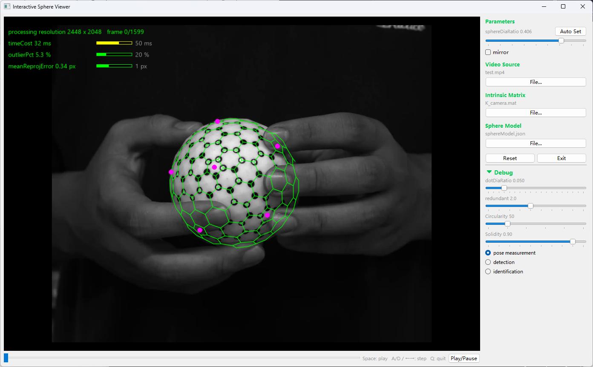
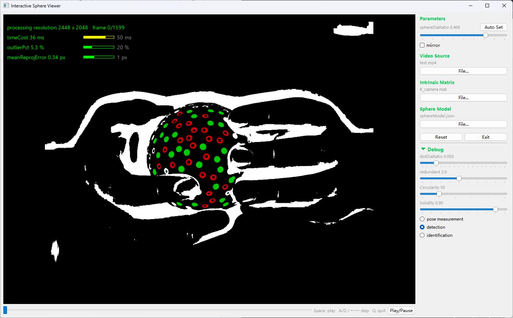
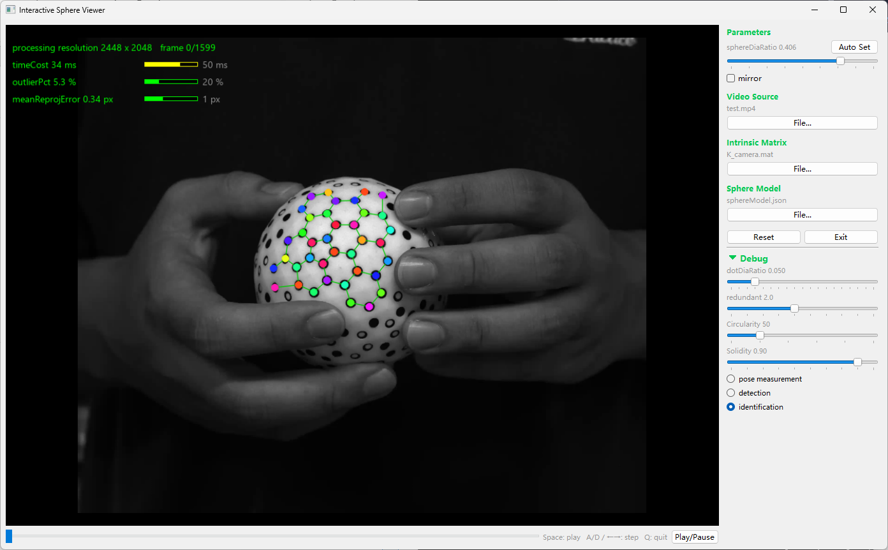

# Interactive Sphere Based on a Graph Marker Field

Demo code for the paper **"Interactive Sphere Based on a Graph Marker Field"**
(submitted to *IEEE Transactions on Instrumentation and Measurement*).

## Overview

This repository provides a demo of the proposed interactive sphere, which carries a
seamless self-identifying graph marker field composed of solid and hollow dots.
Given a video of the sphere, the program detects the dots on the sphere surface,
identifies them against the sphere model, and measures the sphere pose in real time.
Compared with cube- and icosahedron-based markers, the sphere achieves stronger
viewpoint robustness and better occlusion tolerance.

## User Guide

The root directory contains one main script: `main.py`. Run this script if you would
like to interactively explore the interactive sphere. Some preparation is required
before running, as described below.

### 1. Install the dependencies

The demo requires Python 3 with the packages listed in `requirements.txt`
(numpy, opencv-contrib-python, scipy, pillow, PySide6). Install them with:

```bash
pip install -r requirements.txt
```

### 2. Check the material files

In the `Material` folder, there are three files:

- `K_camera.mat` — the camera intrinsic matrix;
- `sphereModel.json` — the 3D coordinates and IDs of all dots on the sphere
  (reconstructed from the fabricated sphere via structure-from-motion);
- `test.mp4` — a recorded video sequence of the sphere.

### 3. Watch the tutorial videos

Please watch the videos in the `video` folder:

- `sphere_handheld.mp4` — handheld tracking of the proposed sphere;
- `Icosahedron_handheld.mp4` — the icosahedron baseline for comparison;
- `AR_video.mp4` — an AR application driven by the measured sphere pose.

### 4. Run the script

```bash
python main.py
```

The algorithm modules live in the `Functions` folder and are loaded automatically.
A Qt window will appear. By default, the demo opens `Material/test.mp4` as the
video source.

### 5. Start the interactive experiment

Once a window appears and the test video is playing, the program will continuously:

1. detect the solid and hollow dots;
2. identify each dot by matching local neighborhoods against the sphere model;
3. estimate the sphere pose from the 2D–3D correspondences;
4. overlay the detected dots, the recovered pose, and the projected model on the live view.

In the test video, the sphere is freely rotated and partially occluded by the hand,
so that the viewpoint robustness and occlusion tolerance reported in the paper can
be observed directly. By default, the view shows the pose measurement result: the
projected mesh of the sphere model, with a magenta dot drawn at the center of each
pentagonal ID tag to indicate the measured pose.



In the **Debug** area:

- switch to **detection** to inspect the binarized image together with the recognized
  dots (green marks solid dots, red marks hollow ones):

  

- switch to **identification** to see each dot labeled with its decoded ID tag
  (shown in different colors) together with the mesh:

  

If the dots are not segmented correctly, first click **Auto Set**, which automatically
determines the sphere diameter parameter (`sphereDiaRatio`); the `dotDiaRatio`,
`redundant`, `Circularity`, and `Solidity` sliders can be adjusted further if
necessary, and **Reset** restores the default parameters.

**Keyboard shortcuts:** `Space` toggles play/pause, `A`/`D` or the left/right arrow
keys step one frame backward/forward, and `Q` quits.

## Repository Structure

```
├── main.py            # Entry point: starts the Qt viewer
├── Functions/         # Detection, identification, pose measurement, rendering, viewer
├── Material/          # Camera intrinsics, sphere model, test video
└── video/             # Demo videos (handheld sphere, icosahedron baseline, AR application)
```
